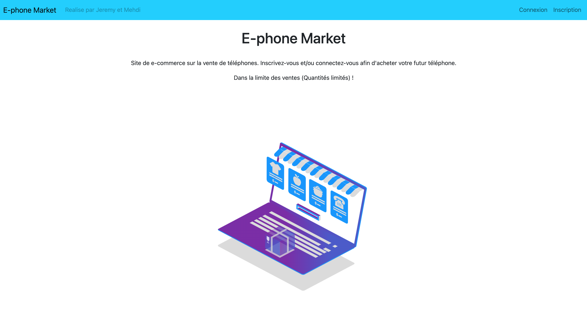

# Projet Architecture Web et plafeforme Java/Jakarta EE 💻

###### tags: `Projet(en cours)`

> *Dernière mise à jour le Vendredi 7 Janvier 2022*

Dans le cadre de notre **cursus d'ingénieur ESEO**, nous avons du développer une application de vente en ligne (version simplifiée) au cours de la matière **Projet Architecture Web et plafeforme Java/Jakarta EE**.

> Développeurs : `Jérémy SELO et Mehdi RECHID`

## :memo: Application Web en J2EE

## Captures d'écran

## Cahier des charges

:warning: La partie *Cahier des charges* est un copier coller du sujet du projet de **Clive FERRET-CANAPE**. :warning:

### :pushpin: Objectifs

L'objectif de cette application va être la mise en pratique des notions suivantes :

- JSP / JSTL
- Base de donnée MariaDB ou MySQL
- Hibernate
- Utilisation du modèle DAO

### :pushpin: Sujet

- [x] Vous devez développer une application de vente en ligne (version simplifiée). Vous avez
le choix des articles en vente, mais ils devront être chacun défini a minima par :
  - Identifiant unique
  - Nom
  - Prix
  - Quantité disponible (stocks du magasin)
- [x] Un client devra s’inscrire pour pouvoir commander et renseigner au minimum les
informations suivantes à son inscription :
  - Nom
  - Prénom
  - Courriel
  - Adresse de livraison
- [x] Une fois inscrit et connecté, le client pourra naviguer sur le site en ligne afin de
sélectionner des articles pour les commander. Il ne pourra valider sa commande que si
les articles sélectionnés sont bien en nombre suffisant dans le stock.
- [x] Une facture sera produite par l’application (détails des articles commandés, montant
total, …) lors d’une commande, mais vous vous affranchirez de la partie paiement.

- [x] Sur son espace (lorsqu’il est connecté) le client pourra visualiser l’historique de ses
commandes.
- [x] Votre application permettra aussi à un administrateur de gérer la boutique en ligne.
Lorsqu’ils seront connectés ils pourront a minima faire les actions suivantes :
  - Ajouter /supprimer des nouveaux articles
  - Modifier les quantités d’un article enregistré
  - Bloquer un client (pas de suppression du compte, mais impossibilité pour le client
de commander)
